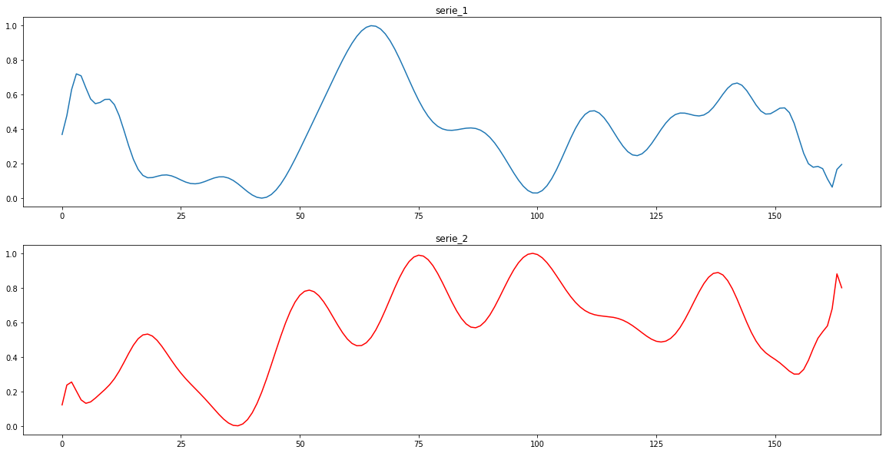

# Social signal classification 

This project contains classification approach to classify time series representing the temporal change of a social signal (e.g. the temporal change of speech rate throughout a public speaking sequence), to classify patterns of behavior.  
We focus on time series explicit's features extrcation. This aims to describe the time series and then classify them  using a generic Machine Learning model for the classification task. Of course, the advantage is to idenditfy the most relevant parameters for the classification task in our use case.

## Reference
- Ginevra Castellano, Marcello Mortillaro, Antonio Camurri, Gualtiero Volpe, Klaus Scherer : Automated Analysis of Body Movement in Emotionally Expressive Piano Performances, Music Perception (2008) 26 (2): 103–119.  
https://doi.org/10.1525/mp.2008.26.2.103